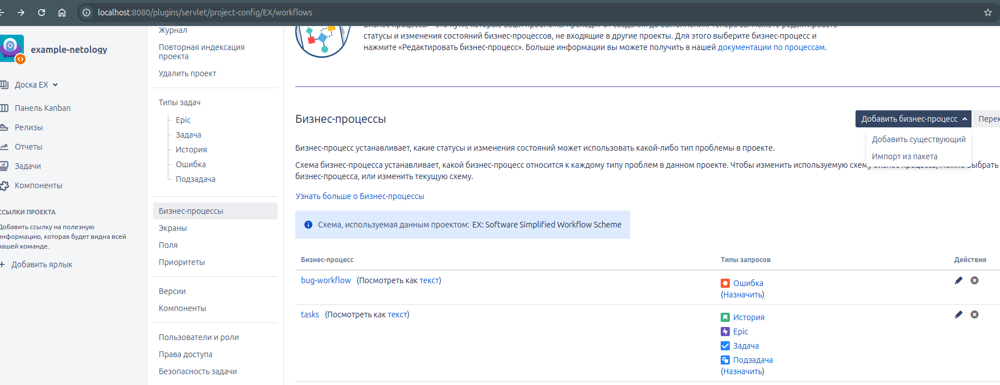

[Задание](https://github.com/netology-code/mnt-homeworks/blob/MNT-video/09-ci-01-intro/README.md)

### Подготовка
- Скачиваем [образ Jira](https://hub.docker.com/r/atlassian/jira-software/#)
- Готовим [compose.yml](compose.yml) для установки Jira + PostgreSQL
- Запускаем http://localhost:8080
- Конфигурим БД:  

- Ключ предлагает взять на сайте atlassian, создаём ключ trial (работает только с VPN).
- Создаём проект, панели Kanban, Scrum.

### Основная часть.
1. Создаём workflow для bug:  

Создаём workflow для остальных задач:

Сменить workflow для типов задач тут:
http://localhost:8080/plugins/servlet/project-config/EX/workflows

Кнопка `Добавитьт бизнес-процесс` -> `Добавить существующий`

Настройка колонок Kanban делается здесь: 
http://localhost:8080/secure/RapidView.jspa?rapidView=1&tab=columns#

Здесь распределяем наши статусы по колонкам. В одной колонке может быть несколько статусов.  

Проходим по всем статусам:  

Возвращаем в статус `open`

Добавить существующую задачу в Epic можно здесь:

Создаём scrum панель, спринт, добавляем все задачи в спринт, проходим по всем статусам.

Инструкция по выгрузке workflow в XML [здесь](https://support.atlassian.com/jira-cloud-administration/docs/import-and-export-issue-workflows/)

Выгружаем [tasks](workflows/tasks.xml) и [bugs](workflows/bug-workflow.xml)
